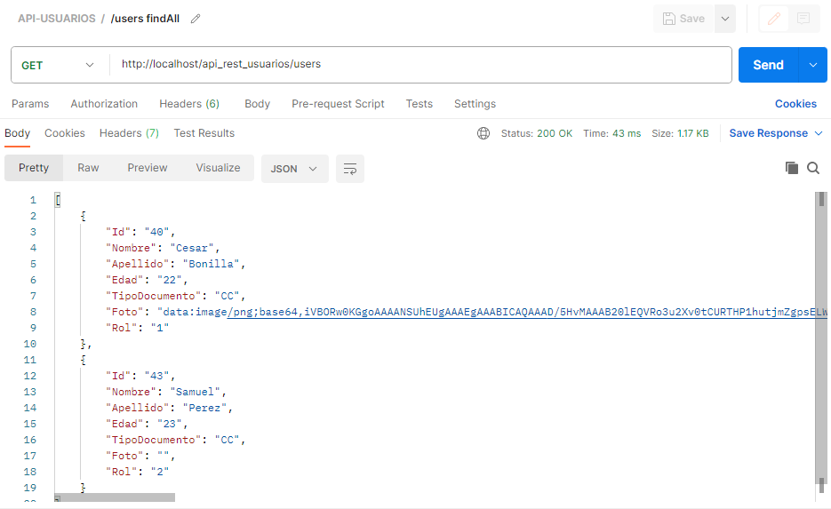

# APIS_PHP
- ImageLook: Consumo API - Imagenes
- Users: API-REST Usuarios
  
## ImageLook

* Pagina Web creada mediante PHP para consumir la API de Pixabay con el fin de obtener imagenes filtradas por palabras clave, tema o ambos.

 

* #### Inicio

 

* #### Filtro 1

 

* #### Filtro 2

 

## Users API-REST

* API-REST creada mediante PHP y MySQL, permite las operaciones de obtener, crear, actualizar y eliminar usuarios.

 

* #### GET

 

* #### POST

 

* #### PUT

 

* #### DELETE

 
